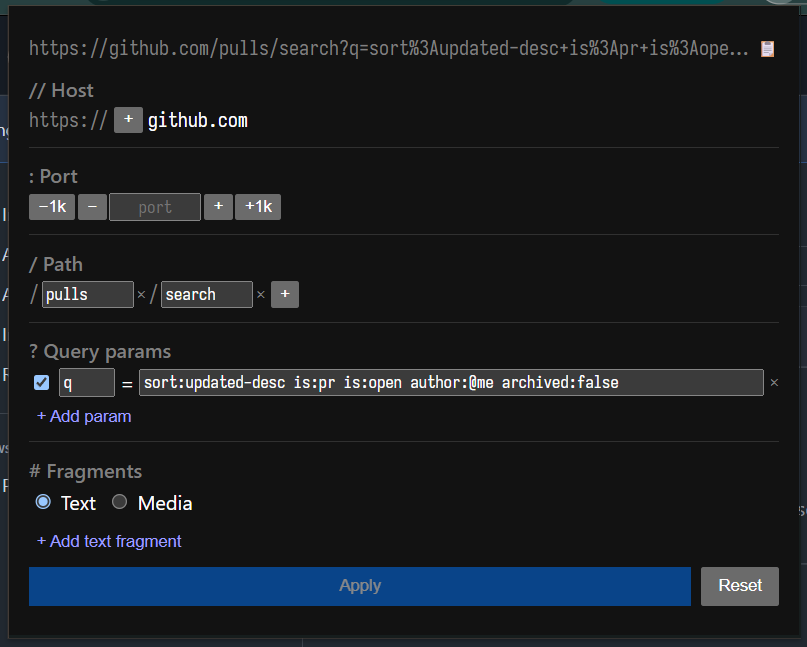

# url_slice

[Source](https://github.com/chadluo/url_slice) &middot; [Chrome Web Store](https://chromewebstore.google.com/detail/urlslice/dpnmhmajfcnidbogkkldpaiapioljepk)

A structural URL editor Chrome extension.

Segmented structural editor of a URL:

- edit individual parts of the URL easier
- switch different hosts of same path
- subdomain, path and URL search params autocomplete from browse history
- JSON and Base64 JSON editing for search params
- port increase/decrease
- open in sidepanel
- copy URL in markdown format

